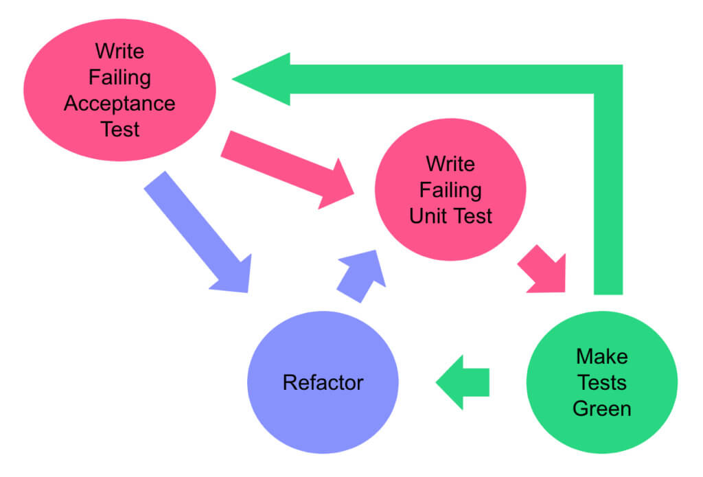

# ToDo
This document provides an overview of [NinjaLABO](https://ninjalabo.ai)'s tasks and objectives for the autumn of 2024. The following sections outline key areas of focus, ranging from way of working (WoW) to model development and hardware deployment strategies.

## WoW
Our [Way of Working (WoW)](https://www.scrum.org/resources/what-is-scrum) aims to ensure efficient and collaborative work among team members. This includes SCRUM practices, GitHub workflows, and workshops for knowledge sharing.

### SCRUM
SCRUM is our core [agile framework](https://www.atlassian.com/agile/scrum), promoting daily check-ins, iterative sprint cycles, and continuous improvement.

#### Daily Scrum

##### 8:15am
- Held on [Discord](https://discord.com/) in the Voice Channel.
- A strict 15-minute standup where everyone declares the following:
  1. What they completed (Done).
  2. What they will work on next (ToDo).
  3. Any blockers or issues (Issue).

##### Rule:
If a topic takes longer than 5 minutes, continue the discussion in backlog item comments or schedule another meeting.

#### Sprint

##### 2-week cycle
Each sprint follows a clear structure, from planning to review, ensuring that we meet our project goals while continuously improving.

###### 1. Planning
- Backlog grooming and sprint planning usually take place on Monday morning at the beginning of the sprint.
- The team selects high-priority tasks from the [backlog](https://www.atlassian.com/software/jira/backlogs).

###### 2. Review
- The review occurs on Friday afternoon at the end of the sprint.
- We assess completed backlog items and discuss progress with stakeholders.

###### 3. Retrospective (Retro)
- After the review, we hold a [retrospective](https://www.atlassian.com/team-playbook/plays/retrospective) to discuss what worked well and what could be improved in our WoW.
- The retro typically happens right after the review on Friday afternoon.

### GitHub
[GitHub](https://github.com/) is our primary tool for project management, code reviews, and CI/CD.

#### Projects

##### KANBAN
- We use the [KANBAN](https://www.atlassian.com/agile/kanban) board to visualize and track our backlog items, ensuring we stay on top of tasks and priorities.

#### Workflow

##### CI/CD
- We follow the [Acceptance Test-Driven Development (ATDD)](https://www.agilealliance.org/glossary/atdd/#:~:text=Analogous%20to%20test%2Ddriven%20development,of%20implementing%20the%20corresponding%20functionality.) approach, which ensures that tests are written based on the system’s behavior before the implementation.

#### Pages
- Using [Nbdev](https://nbdev.fast.ai/), we streamline writing, testing, documenting, and distributing software packages directly from Jupyter Notebooks.

### Workshops
To facilitate knowledge sharing, we conduct [workshops](https://workshops.github.com/), encouraging developers to present and follow along using [Jupyter notebooks](https://jupyter.org/).

## Compression
The following techniques will be our focus for optimizing model performance:

### Profiling
In-depth [profiling](https://pytorch.org/tutorials/recipes/recipes/profiler_recipe.html) is necessary to guide our compression strategies.

#### Quantization
- Reducing the number of bits needed to represent weights and activations with [Post-training Quantization](https://www.tensorflow.org/lite/performance/post_training_quantization).

#### Pruning
- [Pruning](https://pytorch.org/tutorials/intermediate/pruning_tutorial.html) involves removing less critical parameters from the model.

#### Knowledge Distillation (KD)
- Training a smaller model (student) to mimic a larger model (teacher) through [Knowledge Distillation](https://towardsdatascience.com/understanding-knowledge-distillation-6dc3e7b5a3e6).

#### Low-Rank Approximation
- Reducing model complexity by approximating weight matrices with [Low-Rank Factorization](https://arxiv.org/abs/1511.06737).

## HW
Exploring hardware platforms and their capabilities.

### [IREE](https://iree.dev/)
- Investigate the potential of using [IREE](https://iree.dev/) for machine learning workloads.

### CUDA
- Continue optimizing and leveraging [CUDA](https://developer.nvidia.com/cuda-toolkit) for GPU-accelerated tasks.

### JETSON

#### [TensorRT](https://developer.nvidia.com/tensorrt)
- Benchmark and compare model performance with NVIDIA’s [TensorRT](https://developer.nvidia.com/tensorrt) on Jetson devices.

### Orange Pi 5 Plus

#### [LLM on OPi5+](https://blog.mlc.ai/2024/04/20/GPU-Accelerated-LLM-on-Orange-Pi)
- Running [Large Language Models](https://en.wikipedia.org/wiki/Large_language_model) (LLM) on the Orange Pi 5 Plus, evaluating its performance and scalability.

## tinyMLaaS
Our tinyMLaaS focuses on providing scalable machine learning services, particularly for resource-constrained devices.

### [Flexible Pipeline](https://ninjalabo.ai/blogs/summer_insights_2024.html#flexible-pipelining-for-dnn-model-transformations)
- A pipeline for flexible model transformations, such as compression, dockerization, and packaging models for various environments.

#### FastHTML
- Leveraging [FastHTML](https://fast.ai/posts/2021-05-19-why-fastai.html) for quicker model transformations and deployment.

### [Distributed Execution](https://ninjalabo.ai/blogs/summer_insights_2024.html#distributed-execution-of-model-transformations)
- Distributed model execution across nodes, utilizing technologies like [FaaS](https://en.wikipedia.org/wiki/Function_as_a_service) (Function as a Service) and [Docker Swarm](https://docs.docker.com/engine/swarm/).

## tinyRuntime
Our custom runtime for executing deep learning models on various hardware platforms.

### CUDA
- Focus on improving [GPU acceleration](https://developer.nvidia.com/how-to-cuda-coding-gpu) within our runtime.

### CPU
- CPU-based [inference](https://www.analyticsvidhya.com/blog/2020/10/tflite-model-inference-in-python-on-cpu/) and training optimizations.

#### Inference

##### [ResNet50](https://arxiv.org/abs/1512.03385)
- Evaluating inference performance with the [ResNet50](https://keras.io/api/applications/resnet/) model.

###### CNN
- Using [Convolutional Neural Networks (CNN)](https://en.wikipedia.org/wiki/Convolutional_neural_network) to process image data.

##### [Imagenette](https://github.com/fastai/imagenette)
- Benchmarking with the [Imagenette dataset](https://github.com/fastai/imagenette).

##### [Transformers](https://huggingface.co/docs/transformers/index)
- Supporting inference of [Transformers](https://huggingface.co/transformers/), including Large Language Models (LLMs) and Vision Transformers.

#### Training
- Optimizing training pipelines on both [CPU](https://towardsdatascience.com/cpu-vs-gpu-for-deep-learning-b0ad56f60155) and [CUDA-based platforms](https://developer.nvidia.com/deep-learning-training).

## Model
Model development and collaboration projects for 2024.

### [HyperSpectral Imaging](https://en.wikipedia.org/wiki/Hyperspectral_imaging) (HSI)

#### [3D-CNN](https://paperswithcode.com/method/3d-convolutional-network)
- Developing models for [hyperspectral imaging](https://www.sciencedirect.com/topics/engineering/hyperspectral-imaging) using [3D Convolutional Neural Networks](https://paperswithcode.com/method/3d-convolutional-network), particularly for CubeSat applications.

### ESA Tender

#### Large Language Model (LLM)
- Focusing on compression techniques for [LLMs](https://towardsdatascience.com/compressing-large-language-models-c505f2d5a56d), making them more efficient for deployment.

#### Digital Twin (DT)
- Exploring [physics simulation](https://en.wikipedia.org/wiki/Physics_simulation) models as part of the ESA tender.
