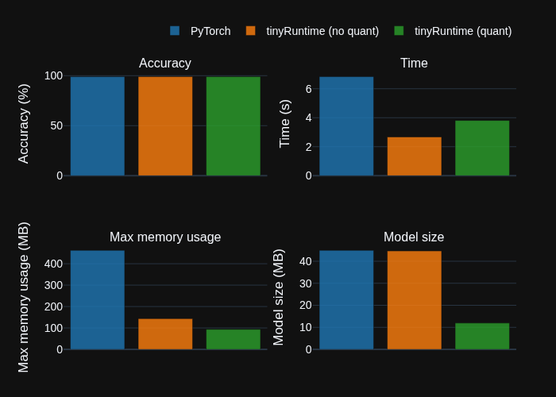
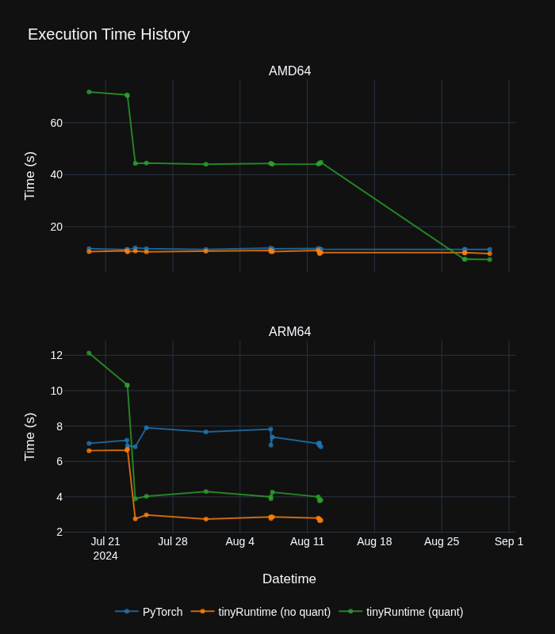
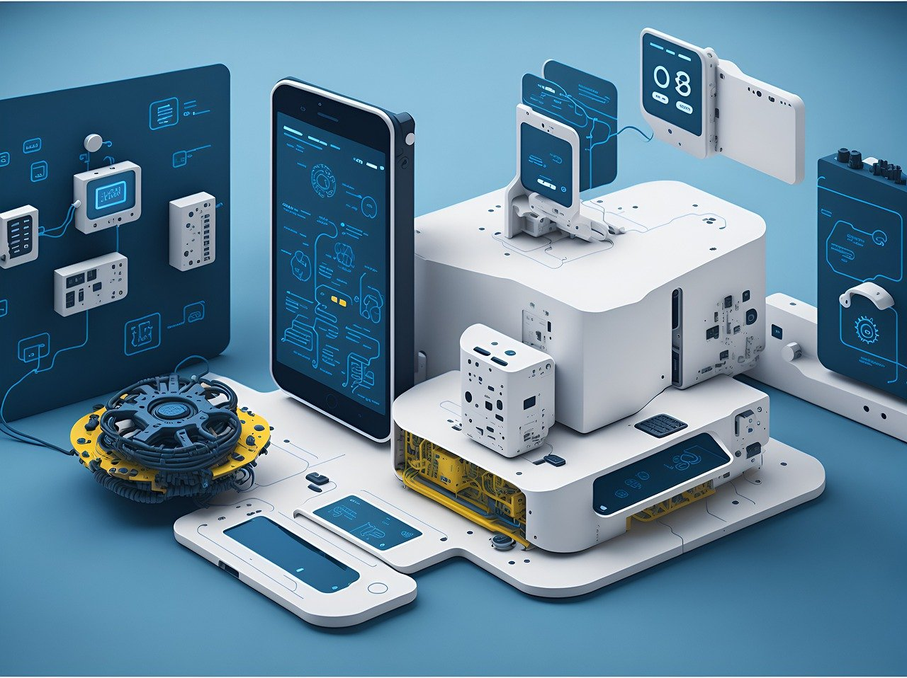
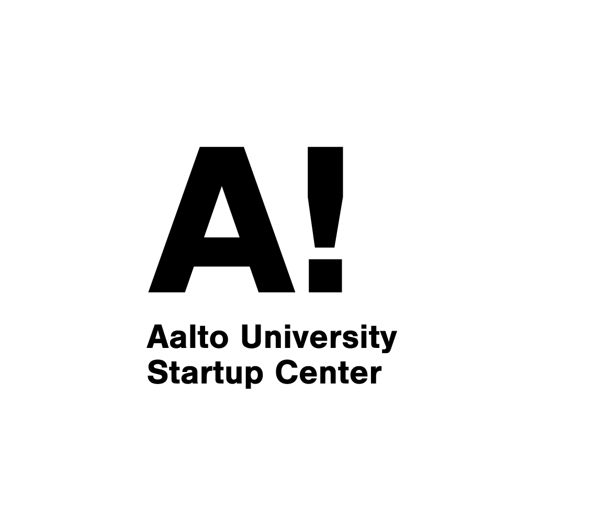
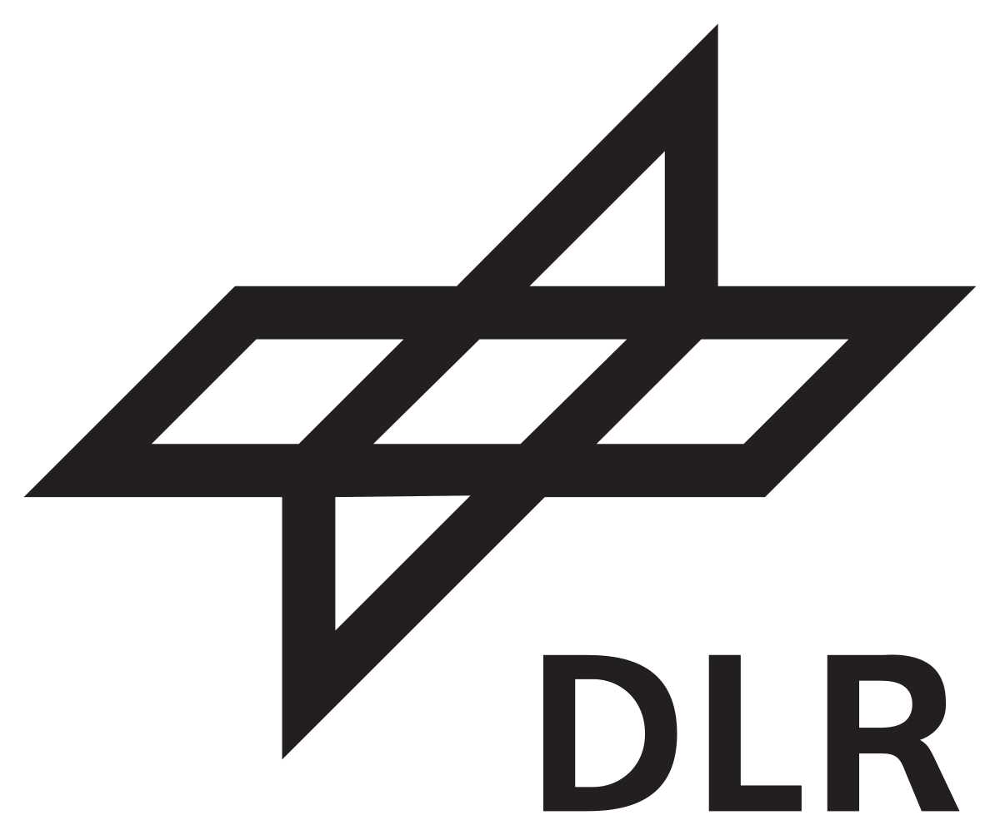
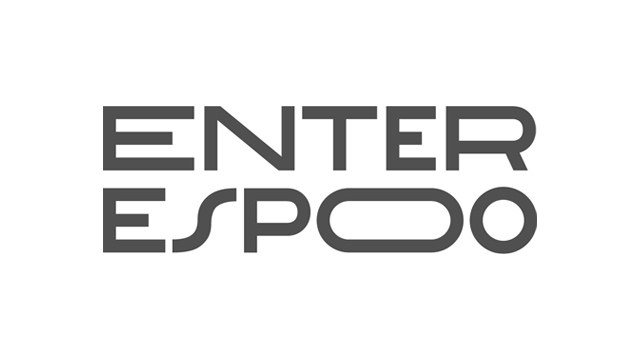

::: {.hero-title}

# [Compress your AI model]{.accented-text}
# with tinyMLaaS

#### Upload your AI model on device for efficient run to save your costs, time, and cloud space

::: {.hero-buttons}
[Get Started](getstarted.qmd){.btn-action-primary .btn-action .btn .btn-success .btn-lg role="button"}
[Request Demo](https://forms.gle/zKjaeEzqoVu7a9vQ8){#btn-guide .btn-action .btn .btn-light .btn-lg role="button"}
:::

:::
<video id="myVideo" class="hero-video" autoplay muted playsinline loop controls>
  <source src="images/opening.mp4" type="video/mp4">
</video>

::: {.hero-content}
Run by [NinjaLABO](https://ninjalabo.ai).
:::

::: {.banner .bg-yellow}
# Latest Updates!
::: {.panel-tabset}

## Blogs

::: {#latest-blogs}
:::

[See all blogs](blog.qmd)

## Performance
::: {.perf-text}
Our latest technology shows significant increase from baseline Pytorch runtime in terms of:

🚀 Model size  
🚀 Running time  
🚀 without largely lowering accuracy
:::

  

## Progress
::: {.perf-text}
We are constantly working to improve our technology! See our latest progress in [Performance page](performance.ipynb).
:::

  

:::
:::

::: {.banner}
# [NinjaLABO]{.accented-text} is a startup aiming to democratize AI accessibility.

#### All AI is running on big cloud GPUs, which are not accessible in some harsh environments. We are bringing AI to the very edge without Cloud dependency, "Cloudless AI".

::: {.feature-card}
::: {.feature-text}
## Minimalize AI
We are a new frontier in the fields of AI and ML which allows for ML models to be run directly on small IoT devices such as microcontrollers, sensors, and other edge devices most notably without being dependent on a connection to the cloud – a noticeable advantage when compared to current AI & ML systems. 
:::

  

:::

::: {.feature-card}

  

::: {.feature-text}
## Save Time, Cost, and Energy
"Cloudless AI" doesn't move the data around so that it could save network round trip time, communication cost and battery consumption.  
:::

:::

::: {.feature-card}
::: {.feature-text}
## Protect your security
"Cloudless AI" doesn't upload the private data on Cloud but instead it processes in place, there is no risk of privacy leakage. 
:::

  

:::
:::

::: {.banner .bg-yellow}
# Partners
::: {.partner-grid}
::: {.partner-card}

:::

::: {.partner-card}

:::

::: {.partner-card}

:::

::: {.partner-card}

:::

::: {.partner-card}

:::

::: {.partner-card}

:::
:::
:::

::: {.banner}
[Get Started](getstarted.qmd){#btn-get-started .btn-action-primary .btn-action .btn .btn-success .btn-lg role="button"}
:::